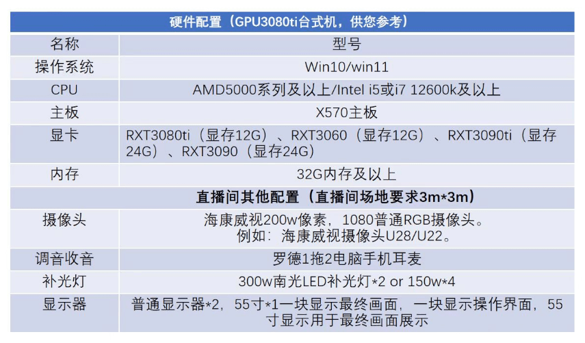

## AIGC
* UGC（全称：User Generated Content）是指广大用户生产的内容。其内容更加大众化和简单化，但是其质量参差不齐。
* PGC（全称：Professional Generated Content）是指专业人士生产的内容。其创作的内容相对UGC更加专业、精准、高质量。
* AIGC（全称：AI Generated Content）是指利用人工智能技术来生成内容。AIGC也被认为是继UGC、PGC之后的新型内容生产方式，AI绘画、AI写作等都属于AIGC的分支。

## ChatGPT
> 可以根据描述生成文本。
* 在线网站（收费/每月$20美元）：https://chat.openai.com
  - 国内无法使用。需要翻墙。
  - ChatGPT是美国人工智能研究实验室OpenAI新推出的一种人工智能技术驱动的自然语言处理工具。
* 国内目前可以免费使用的3.5版本：https://chat1.binjie.site:7777/#/chat/1680339476987

## MidJourney
> 可以根据文本生成图片。
* 在线网站（收费/每月$30美元）：https://www.midjourney.com
  - 国内无法使用。需要翻墙。

## Stable Diffusion
> 可以根据文本生成图片。
* 在线网站（免费）：https://stablediffusionweb.com | https://huggingface.co/spaces/stabilityai/stable-diffusion
  - 第1个输入框输入关键词：`A dolphin jumped out of the splashing water in the aquarium`。
  - 第2个输入框排除关键词`low quality`。
  - 生成的图片不够美观和惊艳，可能是服务器上没有对应的已被训练好的模型。
* 开源项目（免费）：https://github.com/AUTOMATIC1111/stable-diffusion-webui
  - 本地部署时，非常吃电脑的配置，对显卡的要求很高。
  - 需要自行寻找已被训练好的模型并进行应用，如此生成的图片才足够美观。
  - 如何训练模型？去哪下载模型？如何使用模型？[B站](https://www.bilibili.com/)皆有教程！
  - 已被训练好的模型资源（被墙了）：https://civitai.com/
  - 已被训练好的模型资源（可访问）：https://aituzhan.com/
  - 已被训练好的模型资源（可访问）：https://www.liblib.ai/
  - 已被训练好的模型资源（可访问）：https://models.paomiantv.cn/models
  - 已被训练好的模型资源（可访问）：https://huggingface.co/runwayml/stable-diffusion-v1-5/tree/main

## Vega AI 创作平台
> 可以根据文本生成图片。文生图。
* 在线网站（国产/尚未收费）：https://vegaai.net/text2Image
  - 手机访问：https://vegaai.net/phone/creat/text2Image
  - 此网站是基于开源项目Stable Diffusion进行的二开。
  - 案例（风格选手绘头像/模型选虚拟建模）：一个微笑着的短发女孩，汉服，白色背景。
  - 案例（风格选手绘头像/模型选虚拟建模）：一个微笑着的短发女孩，机甲，白色背景。
  - 案例（风格选手绘头像/模型选虚拟建模）：一个微笑着的长发女孩，穿着绿色连衣裙，戴着绿色领结，白色背景。
  - 案例（风格选手绘头像/模型选虚拟建模）：一个微笑着的长发女孩，穿着红色连衣裙，戴着红色领结，白色背景。
  - 案例（风格选手绘头像/模型选虚拟建模）：一个衬衫上戴着红色领结和白色衬衫的短发女孩正看着镜头，她戴着红色领结。

## getimg.ai
> 可以根据文本生成图片。
* 在线网站（收费/每月$12-$99美元）：https://getimg.ai
  - 国内无法使用。需要翻墙。

## ElevenLabs
> 可以根据文本生成音频。
* 在线网站（收费/每月$5-$330美元）：https://beta.elevenlabs.io
  - 中文支持很差。

## 剪映
> 可以根据文本生成音频。也可以根据音频生成文本。
* 抖音出品。中文支持很友好。且免费。

## 一帧秒创
> 可以根据描述生成文本。可以根据文本生成图片。可以根据文本生成音频。可以根据文本生成图文视频。可以视频去水印。
* 在线网站（国产/每月￥88人民币）：https://aigc.yizhentv.com/

## 微软语音合成助手
> 可以根据文本生成音频。
* 在线网站（收费/每1M字符$16美元）：https://azure.microsoft.com/zh-cn/services/cognitive-services/text-to-speech/
  - 中文支持很友好。
  - D-ID使用的应该就是这个。因为里面的选项一模一样。
  - 需要VISA的信用卡才能进行注册使用。

## D-ID
> 可以根据图片和文本生成虚拟数字人播报视频。
* 在线网站（收费/每月$6-$300美元）：https://studio.d-id.com/
  - 支持读取文本。
  - 支持读取音频。
  - 中文支持很友好。
* 国内也有类似的平台或软件。例如腾讯智影平台。硅基智能平台。元分身平台。奇妙元平台。魔珐科技平台。闪剪app。必剪app。
  - D-ID可以自行上传图片。腾讯智影自定义模板费用为每年￥3999-￥19999人民币。
  - D-ID的可配置项很简陋。腾讯智影的可配置项很丰富，可以进行动作配置，例如比心、侧耳倾听等。
  - D-ID提供的有API文档，可以通过程序对接的形式进行相关内容的生成。腾讯智影未看到有相关入口。

## SadTalker
> 可以根据图片和音频生成虚拟数字人播报视频。
* 开源项目（免费）：https://github.com/Winfredy/SadTalker
  - 不支持读取文本。
  - 仅支持读取音频。
  - 在线网站：https://huggingface.co/spaces/vinthony/SadTalker
    - 我生成视频时，总是失败。没有一次是生成成功的。
    - 案例视频，人物有很明显的抖动问题，且视频分辨率低，视频不清晰。体验不如D-ID。
  - 在线网站：https://colab.research.google.com/github/Winfredy/SadTalker/blob/main/quick_demo.ipynb
    - 国内无法使用。需要翻墙。
    - 我未进行尝试。因我不懂Python。
    - 看了别人的生成效果，存在和案例视频同样的问题。人物有很明显的抖动问题，且视频分辨率低，视频不清晰。
* 亲自体验后，发现SadTalker生成的视频，其效果很不错。完全不比D-ID差，取代D-ID进行虚拟数字人的视频制作是完全没问题的。

## 聚力维度 - 赛博演猿 - 虚拟数字人AIGC平台 - 虚拟数字人直播 - 免穿戴 - 单目摄像头动捕
#### 聚力维度网址：https://www.zr-ai.com/
* 需要安装UE4。应是在UE4的基础上进行的二开。
* 如今UE5也已经出来了。
* UE5和Unity3D都是游戏引擎。
#### 电脑配置要求：
```
显卡显存12G以上N卡（3060、3080ti、3090、4080、4090）
内存32G以上
CPU：i5 12代以上
摄像头：1080p
```


## 虚拟数字人直播软件合辑
* https://zhuanlan.zhihu.com/p/581647715

## 虚拟数字人调研 - 虚拟数字人播报调研 - 虚拟数字人直播调研
* https://docs.qq.com/sheet/DWHpoclNJY01DU21Z?tab=BB08J2

## AIGC相关思维导图
* https://docs.qq.com/mind/DWERpRlBZTGlYTmFN

## 腾讯智影24小时数字人全自动直播体验总结
* 生成一个在线视频，进行无限循环播放。然后使用直播伴侣，进行窗口捕获直播。
* 绑定直播间链接，分析直播室弹幕，触发关键词时，进行问题回答。
* 回答问题时，仅仅是去播放另外一个音频文件罢了（此时视频处于静音继续播放状态）。
* 待音频播放完毕，则视频解除静音。

## 怎样系统的学习 AI 绘画？
* https://www.zhihu.com/question/585131423/answer/2938150663

## AI相关的博主 - 数字人制作 - 文本生成视频
* https://space.bilibili.com/431556168/video
* https://space.bilibili.com/3493106383063541/video

## 有感而发随便写写
* 做自媒体最重要的是要有优质内容。
* 想要发财需要拥有能为他人解决问题的能力。
* 若你拥有优质的资源，那进行资源的售卖亦可发财。
  - 资源可以是一篇优质文章。
  - 资源可以是一张精美图片。
