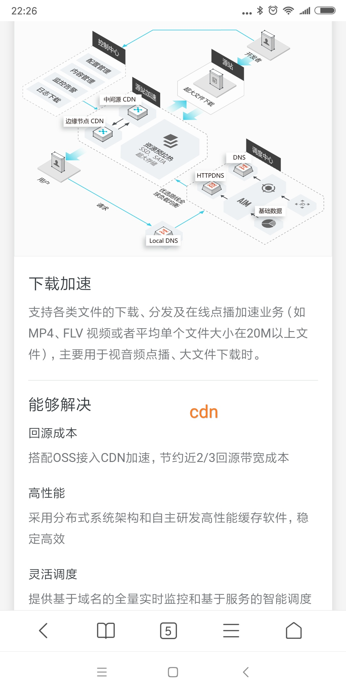
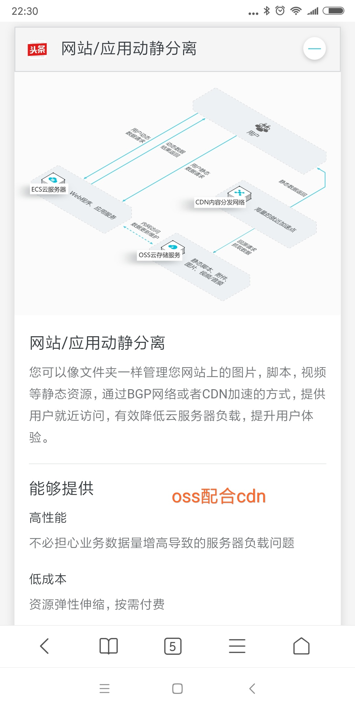

CDN的全称是Content Delivery Network，即内容分发网络。其基本思路是尽可能避开互联网上有可能影响数据传输速度和稳定性的瓶颈和环节，使内容传输的更快、更稳定。通过在网络各处放置节点服务器所构成的在现有的互联网基础之上的一层智能虚拟网络，CDN系统能够实时地根据网络流量和各节点的连接、负载状况以及到用户的距离和响应时间等综合信息将用户的请求重新导向离用户最近的服务节点上。其目的是使用户可就近取得所需内容，解决 Internet网络拥挤的状况，提高用户访问网站的响应速度。
* 用案例去理解
    - 我在上海有个网站，这个网站的域名开启了cdn加速服务，北京有个cdn的节点服务器。
    - 北京的某个用户访问我这个网站。
    - 首先会访问北京的节点服务器，服务器上发现没有资源会去上海服务器上请求，拿到资源之后返回给用户并把资源缓存起来。
    - 这样北京的其他用户再访问我这个站点时，还是会访问北京的节点服务器，但是此时北京的节点服务器上已经有资源了，访问起来就会很快，比直接访问上海的服务器要快，毕竟距离在哪里摆着。
    - 其他地区同理。

* 为什么能就近选择CDN节点？
    - CDN服务提供商，对开启了CDN服务的域名进行DNS解析，解析到你访问时，距离你最近的那台CDN节点服务器上。具体内部是怎么实现的，无需关心。
    - 注意：要启用CDN加速服务，需要将您的加速域名指向CDN节点的CNAME地址，这样访问加速域名的请求才能转发到CDN节点上，达到加速效果。

* 源站域名，加速域名，CNAME，OSS
    - OSS(Object Storage Service对象存储服务)
    - 源站域名：CDN回源拉取资源。源站可以是你自己的服务器，也可以是OSS。
    - 加速域名：访问这个域名时，可以进行CDN加速，需要绑定服务商提供的CNAME。
    - 加速域名不能和源站域名相同。
    - 全站加速开启时默认全部使用纯动态加速（静态资源也使用动态加速回源获取，不缓存）。如果需要缓存静态文件，在添加加速域名后，手动配置动静态资源规则指定静态文件的类型。

* 文档
    - cdn：https://help.aliyun.com/product/27099.html?spm=a2c4g.750001.2.15.cH5sdP
    - cdn全站加速：https://help.aliyun.com/document_detail/64836.html?spm=5176.11065259.1996646101.searchclickresult.4af04cb8IHqCAn

* 图解
    - 
    - 
