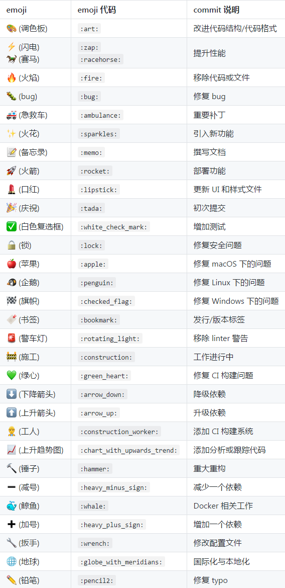

# git - 虽然经常使用,但还是随手记录一下吧
* 新建分支
```
git checkout -b branchName
```
* 推到远程仓库
```
git push
```
* 删除远程分支
```
git push origin :branchName
或
git push origin --delete branchName
```
* 更新远程分支, -p表示如果远程被删除了,本地的也会被删除
```
git pull -p
```
* 新建本地分支并关联远程分支
```
git checkout -b branchName origin/branchName
```
* 删除本地分支
```
git branch -D branchName
```
* 回滚
```
git  reset --hard commitId
```
* 常用
```
git add .
git commit -m log
git pull
git push
```
* 将本地的一个普通目录与远程仓库进行关联
```
git init
git remote add origin https://github.com/zhouhuafei/test.git
git push --set-upstream origin master
```
* 取消本地目录下关联的远程库：
```
git remote remove origin
```
* 每次提交输入密码太麻烦,以下是解决方案
```
git config --global credential.helper store
```
* git打tag(标签)
    - https://git-scm.com/book/zh/v1/Git-%E5%9F%BA%E7%A1%80-%E6%89%93%E6%A0%87%E7%AD%BE
    ```
    git tag v1.0.0 // 打标签
    git tag // 查看标签
    git push origin v1.0.0 // 推送本地新增的标签
    git push origin --tags // 推送本地新增的所有标签
    ```

* git commit 添加表情
    - 
    ```
    git commit "message :trollface:"
    ```
