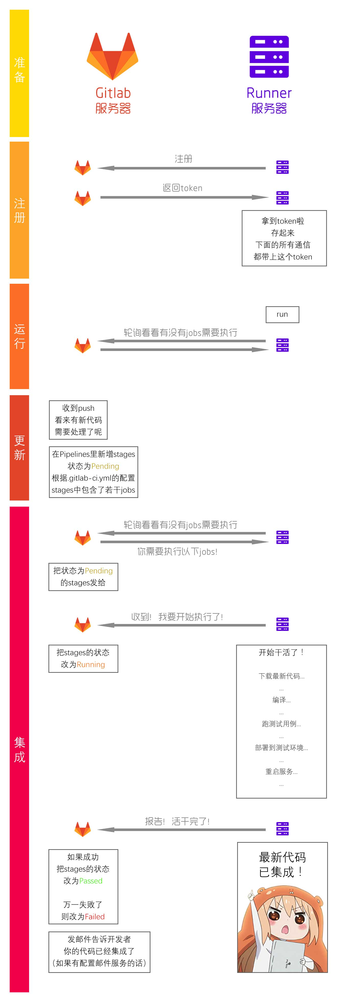

# 文档
* https://about.gitlab.com/downloads/
* https://github.com/gitlabhq/gitlabhq/

# GitLab CI/CD
* 官方文档-安装和启动`runner`：https://docs.gitlab.com/runner/install/
* 官方文档-配置`.gitlab-ci.yml`文件：https://docs.gitlab.com/ee/ci/yaml/README.html
* 安装和后续执行Jobs时的踩坑经历可在本项目进行全局搜索关键字`gh-pages报错案例3`。
* 原理：`runner`服务器轮询`gitlab`服务器。而不是后者通知前者。所以就算`runner`服务器需要`VPN`才能访问也没关系。

