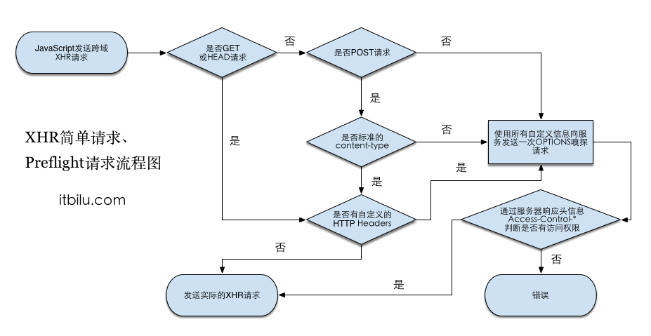

# GET和POST的区别
* GET是从服务器上获取数据，POST是向服务器传送数据。
* GET会被浏览器默认缓存，POST不会(除非手动设置，一般也不会给POST设置缓存)。
* GET是把参数数据队列加到提交表单的ACTION属性所指的URL中，值和表单内各个字段一一对应，在URL中可以看到。POST是通过HTTP POST机制，将表单内各个字段与其内容放置在HTML HEADER内一起传送到ACTION属性所指的URL地址。用户看不到这个过程。
* GET传送的数据量较小，不同浏览器限制不一样，一般在2KB-8KB，前者是IE浏览器的限制，后者是Chrome浏览器的限制，建议不要超过2KB。POST方式，传送数据最大理论上没有限制，取决于服务器设置和内存大小。
* GET安全性非常低(数据在url上明文，会被别人一眼看走)，POST安全性较高(相对GET来说较高，并非绝对安全)。但是执行效率却比Post方法好。
* 对于GET方式，服务器端用Request.QueryString获取变量的值，对于POST方式，服务器端用Request.Form获取提交的数据。
* 建议：
    - GET方式的安全性较Post方式要差些，包含机密信息的话，建议用Post数据提交方式；
    - 在做数据查询时，建议用Get方式；而在做数据添加、修改或删除时，建议用Post方式；

# OPTIONS
* CORS（跨域）才可能会触发OPTIONS预检请求。
* OPTIONS方法是用于请求获得由Request-URI标识的资源在请求/响应的通信过程中可以使用的功能选项。通过这个方法，客户端可以在采取具体资源请求之前，决定对该资源采取何种必要措施，或者了解服务器的性能。该请求方法的响应不能缓存。
* OPTIONS请求方法的主要用途有两个：
    - 获取服务器支持的HTTP请求方法；也是黑客经常使用的方法。
    - 用来检查服务器的性能。例如：AJAX进行跨域请求时的预检，需要向另外一个域名的资源发送一个HTTP OPTIONS请求头，用以判断实际发送的请求是否安全。
* 请求接口明明是GET和POST，然而请求时却先进行了OPTIONS请求，后进行了正常的请求。(问题)
    - 1、请求以 GET, HEAD 或者 POST 以外的方法发起请求。或者，使用 POST，但请求数据为 application/x-www-form-urlencoded, multipart/form-data 或者 text/plain 以外的数据类型。比如说，用 POST 发送数据类型为 application/json 或者 application/xml 或者 text/xml 的 XML 数据的请求。
    - 2、使用自定义(非标准)请求头（比如添加诸如 X-PINGOTHER）
    - 其他如图所示
    

* 请求接口明明是GET和POST，然而请求时却先进行了OPTIONS请求，后进行了正常的请求。(解决方案)
    - 1、针对第一点，可在服务端处理，代码如下。
    ```
    res.header('Access-Control-Allow-Origin', '*');
    res.header('Access-Control-Allow-Headers', 'Content-Type, Content-Length, Authorization, Accept, X-Requested-With , yourHeaderFeild');
    res.header('Access-Control-Allow-Methods', 'PUT, POST, GET, DELETE, OPTIONS');
    if (req.method == 'OPTIONS') {
        res.send(200);
    }
    ```
    - 2、使用标准的请求头。例如使用Authorization而不是使用token。或者后端设置Access-Control-Allow-Headers的值，使之允许接收这个自定义(非标准)的请求头。

* 企微机器人接口报跨域时，消息理应也会推送到群里，但是为何我测试时却没推送呢？如何做可以使之推送？
  - 答1：因为请求头使用了`'Content-Type': 'application/json'`，优先触发了`OPTIONS`请求，此请求对跨域进行了预检。浏览器检测到响应头里没配置跨域，则停止对服务器进行正式请求。
  - 答2：我把请求头改为了`Content-Type: text/plain`后，虽然接口会报跨域，但消息依然会正常推送。
  - 答2：使用反向代理解决跨域问题后，消息自然可以正常推送。

# 请求方式应该大写
* 根据RFC2616，HTTP Method是区分大小写的。GET/POST/PUT/DELETE。
* RFC2616：超文本传输协议HTTP/1.1。

# 请求带数据时在chrome浏览器中的表现
> get请求的headers中没有Content-Type这个字段。
>> 新版chrome浏览器，get请求的headers中有Content-Type这个字段了。不过会先提前发一个OPTIONS请求鉴定是否支持Content-Type值为application/json的类型。
>>> 我个人觉的没啥卵用。因为get请求的数据主体依然是query类型（a=1&b=2）。
* GET
    - 在General中```Request Method: GET```
    - 数据在Query String Parameters中可以看到
> post请求的headers中常用的Content-Type如下。
* POST
    - 在General中```Request Method: POST```
    - 在Request Headers中```Content-Type: application/x-www-form-urlencoded```
    - 数据在Form Data中可以看到
* POST
    - 在General中```Request Method: POST```
    - 在Request Headers中```Content-Type: multipart/form-data```
    - 数据在Form Data中可以看到
* POST
    - 在General中```Request Method: POST```
    - 在Request Headers中```Content-Type: application/json```
    - 数据在Request Payload中可以看到
