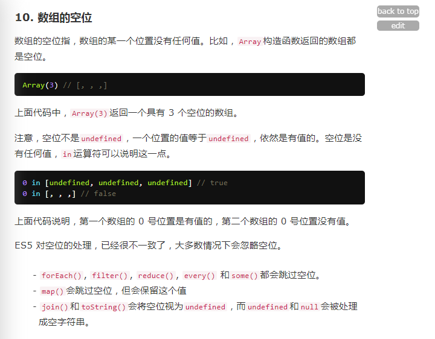

# 图

* 为上图最后一句话的添加解释：视为undefined，不是说会转成字符串'undefined'，最后还是会转为空字符串。
```javascript
[1, , 2, null, undefined].join(''); // '12'
```

# 稀疏数组
* 如果指定的属性在指定的对象或其原型链中，则in 运算符返回true。以下皆是稀疏数组。
    ```
    var arr = [, , , ,];
    1 in arr; // false;
    var arrs = [a, , c];
    1 in arrs; // false;
    var arrx = new Array(10);
    1 in arrx; // false;
    ```
* 稀疏数组不会被map方法处理
    ```
    [, , , ,].map(() => 1); // [, , , ,]
    [, , , ,][0] === undefined; // true
    ```
* 值为空字符串或者undefined的数组并不是稀疏数组
    ```
    [undefined, undefined, undefined, undefined, undefined].map(() => 1); // [1, 1, 1, 1, 1]
    ```

* map、forEach、filter等方法不会处理稀疏数组中的空项。
    - 案例：
    ```javascript
    const arr = [1, 2, 3];
    arr.length = 5;
    arr.forEach(v => { console.log(v) }); // 只会打印1 2 3
    ```
    - 空项：
        - 空项：empty，完全是空项，不是null，不是空字符串，也不是undefined。
        - 在Chrome浏览器的控制台中打印上述整个数组时，展现出来的就是```[1, 2, 3, empty x 2]```，通过索引获取空项时，返回undefined。
    - 解决方案：把稀疏数组变成非稀疏数组(正常的普通数组)。
    ```javascript
    const arr = [1, 2, 3];
    arr.length = 5;
    [...arr].forEach(v => { console.log(v) }); // 会打印1 2 3 undefined undefined
    ```
    - 怎么把稀疏数组变成非稀疏数组
        - ```Array.apply(Array, new Array(10))```
        - ```[...new Array(10)]```

* 类数组转数组
    - ```Array.apply(Array, {length:10})```转出来的不是稀疏数组
    - ```Array.from({length:10})```转出来的不是稀疏数组
    - ```Array.prototype.slice.call({length:10})```转出来的是稀疏数组
