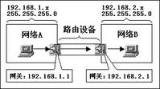
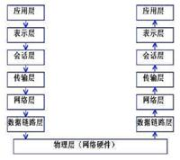

# 网关

* 网关(Gateway)又称网间连接器、协议转换器。
* 网关在网络层以上实现网络互连，是复杂的网络互连设备，仅用于两个高层协议不同的网络互连。
* 网关既可以用于广域网互连，也可以用于局域网互连。 
* 网关是一种充当转换重任的计算机系统或设备。
* 使用在不同的通信协议、数据格式或语言，甚至体系结构完全不同的两种系统之间，网关是一个翻译器。
* 与网桥只是简单地传达信息不同，网关对收到的信息要重新打包，以适应目的系统的需求。
* 案例：
  - 网关实质上是一个网络通向其他网络的IP地址。
  - 比如有网络A和网络B。
  - 网络A的IP地址范围为192.168.1.1~192.168.1.254，子网掩码为255.255.255.0。
  - 网络B的IP地址范围为192.168.2.1~192.168.2.254，子网掩码为255.255.255.0。
  - 在没有路由器的情况下，两个网络之间是不能进行TCP/IP通信的，即使是两个网络连接在同一台交换机(或集线器)上。
  - TCP/IP协议也会根据子网掩码(255.255.255.0)判定两个网络中的主机处在不同的网络里。
  - 而要实现这两个网络之间的通信，则必须通过网关。
  - 如果网络A中的主机发现数据包的目的主机不在本地网络中，就把数据包转发给它自己的网关，再由网关转发给网络B的网关，网络B的网关再转发给网络B的某个主机。

# OSI七层网络参考模型

* Layer 7：应用层(Application Layer)
* Layer 6：表示层(Presentation Layer)
* Layer 5：会话层(Session Layer)
* Layer 4：传输层(Transport Layer)
* Layer 3：网络层(Network Layer)
* Layer 2：数据链路层(Data Link Layer)
* Layer 1：物理层(Physical Layer)
