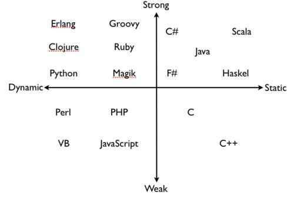

> 动态类型语言和静态类型语言以及强类型语言和弱类型语言以及编译型语言和解释型语言以及低级语言和高级语言以及机器语言和汇编语言

# 动静强弱

# HTML是什么
* HTML 指的是超文本标记语言 (Hyper Text Markup Language)
* HTML 不是一种编程语言，而是一种标记语言 (markup language)

# CSS是什么
* CSS 指层叠样式表 (Cascading Style Sheets)
* CSS 不是一种编程语言。

# Sass是什么
* Sass(Scss)是世界上最成熟、稳定和强大的专业级CSS扩展语言 (Syntactically Awesome StyleSheets)
* CSS预处理器是用一种专门的编程语言，进行Web页面样式设计，然后再编译成正常的CSS文件，以供项目使用。
  - Sass(Scss)就是CSS预处理器的一种。
  - 固Sass(Scss)是一种编程语言。

# 编程语言
> `编程语言`俗称`计算机语言`，种类非常的多，总的来说可以分成`机器语言`、`汇编语言`、`高级语言`三大类。
* 低级语言(面向机器)
  - 机器语言：是计算机可以识别并运行的二进制代码。
  - 汇编语言：是将二进制的机器码通过助记符的方式让人可以更方便的编写并检查的低级语言。
      - 汇编语言接近机器语言，可以看做是机器语言的另一种形式，计算机在运行时也需要将其变为机器语言的二进制才可运行。
      - 汇编语言亦称为符号语言。
* 高级语言(面向用户)
    - 最接近人类语言，但机器是无法执行的，需要最终编译链接成二进制的机器代码才可被计算机执行。
    - 高级语言有java、c、c++、c#、python、javascript、nodejs、typescript、go、易语言等。

# 动态类型语言和静态类型语言
* 动态类型语言：动态语言是运行时检查变量类型的语言。动态语言有 PHP、Python、JavaScript 等。
    - 脚本语言又被称为扩建的语言，或者动态语言。脚本语言是一种解释性的语言。
    - 脚本语言都是动态语言，而动态语言都是解释型语言。
    - 脚本语言有：PHP、Python、JavaScript、Lua、Scala、VBScript，ActionScript，MAXScript，ASP，JSP，SQL，Perl，Shell，Ruby，JavaFX，AutoIt等。
* 静态类型语言：静态语言是编译时检查变量类型的语言。静态语言有 C、C++、Java、C# 等。
  - 静态显示类型：如果类型是语言语法的一部分。
    - 例如：JAVA
  - 静态隐式类型：如果类型通过编译时推导。
    - 例如：TypeScript
  - 特性：定义时，变量a如果是字符串类型，则后续不允许被更改为其他类型。

# 强类型语言和弱类型语言
* 强类型语言：强类型语言偏向于不容忍隐式类型转换。强类型语言有 Java、C#、Python 等。
    - 譬如说 Haskell 的 int 就不能变成 double。
* 弱类型语言：弱类型语言偏向于容忍隐式类型转换。弱类型语言有 C、C++、JavaScript 等。
    - 譬如说 C/C++ 语言的 int 可以变成 double，指针可以完全绕过类型系统。

# 编译型语言和解释型语言
* 编译型语言：编译型语言需通过编译器将源代码编译成机器码，之后才能执行。一般需经过编译、链接这两个步骤。编译型语言有 C、C++ 等。
* 解释型语言：解释性语言的程序不需要编译，相比编译型语言省了道工序，解释性语言在运行程序的时候才逐行翻译。解释型语言有 Python、JavaScript 等。
* 半编译半解释型语言：编译时不生成机器码，生成中间码或字节码。代码语言有 Java、C# 等。(Java 执行时接近解释型，C# 执行时接近编译型)。

# 案例：
* JavaScript：动态类型语言、弱类型语言、解释型语言。
* TypeScript：静态类型语言、强类型语言、半编译半解释型语言。
* Python：动态类型语言、强类型语言、解释型语言。
* Java：静态类型语言、强类型语言、半编译半解释型语言。
* Go：静态类型语言、强类型语言、编译型语言。
