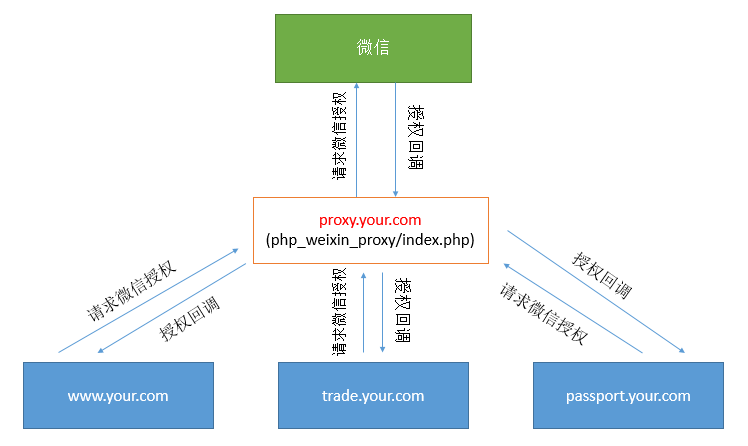

# 微信公众号只能设置一个授权域名问题解决
> 原理：使用代理服务器进行域名代理。

# 步骤
* 0、申请代理服务器的app_key和app_secret。
* 1、拿app_key和app_secret和我们的回调地址打接口，拿代理服务器的token和微信的授权地址。
  - 微信的授权地址参数上绑定的回调地址是代理服务器域名的回调地址。
  - 代理服务器会记录我们的回调地址，等微信授权完毕，代理服务器会对我们回调地址进行回跳。
  - 此时的token还换取不到用户信息，因为还没进行微信授权。
  - 打我们自己后端的接口，让后端去转，防止暴露app_key和app_secret。
* 2、拿到回调地址之后，跳入回调地址进行微信授权，因微信授权地址参数上的回调地址是代理服务器的回调地址，所以微信授权完会跳入代理服务器的回调地址并携带code。
* 3、代理服务器拿code换用户信息并存储。然后再跳入到我们的回调地址。
* 4、此时，我们在自己的项目中，用代理服务器的token，即可拿到用户信息。
* 5、把代理服务器的token给我们自己的后端，去换取我们项目自己的token。
  - 后端拿代理服务器的token去换取用户信息以及记录用户信息并返回我们项目自己的token。
* 6、如果代理服务器的token过期，则换取用户信息会失败(也可能用户没授权)，失败的话，清理掉代理服务器的token，重新走授权流程即可。
* 代码流程：
  - 我们自己服务器的token存在的话，则走页面流程。
  - 不存在则检测代理服务器的token存不存在。
  - 代理服务器的token也不存在则获取代理服务器的token并记录以及走授权流程。
  - 授权流程走完，会回跳回来，此时发现代理服务器的token存在则用它换取我们自己的token。
  - 换取失败了就清理掉本地记录的代理服务器token并重新获取代理服务器token并记录以及走授权流程。
  - 换取成功了，则走页面流程。
