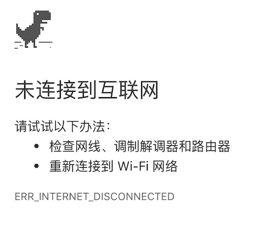
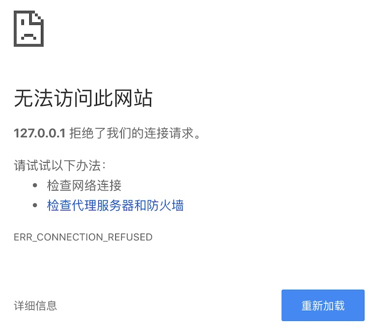

# 客户端没网 - ERR_INTERNET_DISCONNECTED

# 服务没开启 - ERR_CONNECTION_REFUSED - 没使用网关（Nginx） - 直接访问域名

# 服务超时未响应 - ERR_EMPTY_RESPONSE - 没使用网关（Nginx） - 直接访问接口路径（GET） - 接口响应超时

# 域名不存在 - DNS_PROBE_FINISHED_NXDOMAIN

# 网关崩掉了 - ERR_CONNECTION_TIMED_OUT - 使用了网关（Nginx）但是网关（Nginx）没正常启动 - 直接访问域名

* 如果网关（Nginx）启动了，就算对应域名的配置没有，只要域名解析到了对应的服务器，默认会读取Nginx默认配置下的index.html。
* 如此，就不会出现上图报错，固我个人推测，肯定是网关（Nginx）没正常启动。
* 如果网关（Nginx）正常启动了，报错时，会有网关（Nginx）专属的502错误界面和504错误界面。
