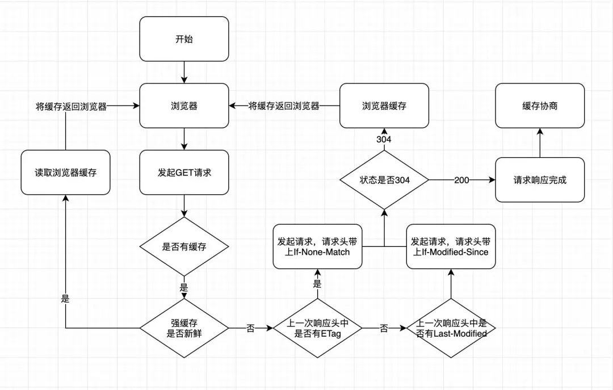

200和304
# 缓存304 Not Modified
* 先对服务器进行请求,服务器发现这个资源没有变,告诉你这个资源没有变,然后使用304缓存,服务器会从缓存中调用你要访问的内容。
# 200 OK (from disk cache) (from memory cache)
* 不对服务器进行请求,直接使用内存缓存
* 先缓存到磁盘,进程关闭,缓存依旧有效
* 再缓存到内存,进程关闭,缓存立即失效,失效之后下次进来,会去磁盘找缓存,找到之后会再次缓存到内存

# max-age是秒数
```
Cache-Control: public, max-age=31536000
```
* 使用nodejs的框架express设置这个缓存的时候是通过毫秒数设置的。
* 浏览器的响应头里显示出来是秒数。

# Cache-Control的特性 - 如果客户端是Chrome浏览器
* 如果是使用的自己的服务器，用nginx配置的Cache-Control。
  - 地址栏直接访问html，虽然响应头中有Cache-Control，但是只要点了浏览器的刷新按钮，则缓存就不会有效。
    - 点击后退再点击前进，才会出现from disk cache，说明读取的是本地缓存。
    - 点了浏览器的刷新按钮，虽然html的缓存不会生效，但是html内引入的其他静态资源，缓存是有效的。
  - 地址栏直接访问html内引入的其他静态资源，虽然响应头中有Cache-Control，但是只要点了浏览器的刷新按钮，则缓存就不会有效。
    - 点击后退再点击前进，才会出现from disk cache，说明读取的是本地缓存。
  - 个人总结：当客户端是Chrome浏览器，如果你点了刷新按钮。
    - 首条请求的Cache-Control会失效。
    - 其他请求的Cache-Control会生效。
* 重点：浏览器的Cache-Control在什么场景下会生效？什么场景下会失效？下述均为亲测！
  - 场景1：ctrl+f5：对应页面上，所有请求的Cache-Control都失效。
  - 场景2：地址栏回车、a链接跳转、前进、后退：对应页面上，所有请求的Cache-Control都生效。
    - 地址栏回车的表现形式有点奇怪。首条请求的Cache-Control是否有效，和是否打开了开发者工具有关。
    - 打开了开发者工具的场景下，首次回车加载的很快，可以看到所有请求的Cache-Control都生效了。
    - 打开了开发者工具的场景下，二次回车加载的很慢，等同于点击刷新按钮，可以看到首条请求的Cache-Control失效了，其他请求的Cache-Control依然有效。
    - 没打开开发者工具的场景下，首次回车和二次回车加载的都很快，明显可以感受到Cache-Control生效了。
  - 场景3：f5、点击刷新按钮：通过开发者工具可以看到，页面加载缓慢，且首条请求的Cache-Control失效了，其他请求的Cache-Control依然有效。
    - 但是如果不打开开发者工具，刷新时，页面加载明显变快。那能不能说明是首条请求的Cache-Control生效了呢？
    - 于是我进行了下述测试：测试结果说明，刷新时首条请求的Cache-Control并没有生效。
      - 我去服务器上修改了页面的title。
      - 通过场景2测试，渲染的是本地缓存的title。说明页面上所有请求的Cache-Control都生效了。
      - 通过场景3测试，渲染的是新title，说明首条请求的Cache-Control失效了。
    - 那为什么打开开发者工具，进行页面刷新时，页面加载缓慢。而不打开开发者工具，进行页面刷新时，页面加载明显变快呢？
      - 具体原因我也不清楚。我猜测，开发者工具本身，需要对页面进行解析，以至于页面加载缓慢。
* 注意：Cache-Control并不是对所有的请求都有效。
  - 亲测：当Cache-Control应用在XHR上时，对GET和HEAD请求有效，对POST请求无效。
  - 
* 总结：缓存的机制和客户端有关，不同的客户端特性不一。
  - 上述是Chrome浏览器的特性。
  - Android或IOS客户端可以调整webview的缓存策略。
    - app内嵌h5，html的响应头上有Cache-Control。
    - 有人遇到过IOS页面可以正常加载，Android一直加载老页面的问题。
    - 不过我做来伊份app内嵌h5时，并没有遇到这种问题。
    - 这就涉及到了webview的缓存策略：https://www.jianshu.com/p/4e5049101271
    - 给url上加个`?v=随机数`一定可以防止页面被缓存。万一哪天遇到了上述问题，可以尝试让app端使用这种方式清理缓存。
    - 也有说给html加meta标签清理Cache-Control缓存的，可是如果页面已经被缓存在本地了，就算meta标签有用，也已经晚了。
* 如果是使用的七牛，不管是html还是css亦或是js，只要文件被访问一次，就会一直被缓存。
  - 因为七牛自带cdn，文件被缓存到了七牛的cdn服务器上。
  - 即使强刷浏览器，删除七牛上的文件，更换七牛上的文件，都无用，缓存一直都在。
  - 除非你去七牛后台手动清除对应文件的缓存。或者给url上加个`?v=随机数`使之溯源。
  - 本地的from disk cache特性和上述一致，也是点击后退再点击前进，才会出现from disk cache，说明读取的是本地缓存。
