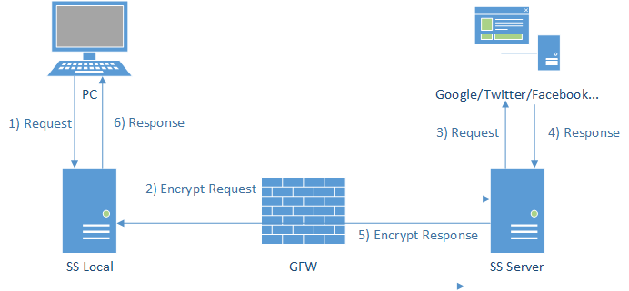

* 摘自 https://www.jianshu.com/p/44c7b9aab614

# 1
* 在很久很久以前，我们访问各种网站都是简单而直接的，用户的请求通过互联网发送到服务提供方，服务提供方直接将信息反馈给用户

# 2
* 然后有一天，GFW 就出现了，他像一个收过路费的强盗一样夹在了在用户和服务之间，每当用户需要获取信息，都经过了 GFW，GFW将它不喜欢的内容统统过滤掉，于是客户当触发 GFW 的过滤规则的时候，就会收到 Connection Reset 这样的响应内容，而无法接收到正常的内容。
* PS：金盾工程（英语：Golden Shield Project ）简称：GFW， 正式名称为全国公安工作信息化工程，为中华人民共和国公安机关提出的全国性网络安全基础建设。

# 3
* 聪明的人们想到了利用境外服务器代理的方法来绕过 GFW 的过滤，其中包含了各种HTTP代理服务、Socks服务、VPN服务… 其中以 ssh tunnel 的方法比较有代表性
* 首先用户和境外服务器基于 ssh 建立起一条加密的通道
    - 用户通过建立起的隧道进行代理，通过 ssh server 向真实的服务发起请求
    - 服务通过 ssh server，再通过创建好的隧道返回给用户
* 由于 ssh 本身就是基于 RSA 加密技术，所以 GFW 无法从数据传输的过程中的加密数据内容进行关键词分析，避免了被重置链接的问题，但由于创建隧道和数据传输的过程中，ssh 本身的特征是明显的，所以 GFW 一度通过分析连接的特征进行干扰，导致 ssh存在被定向进行干扰的问题

# 4 shadowsocks
* 于是 clowwindy 同学分享并开源了他的解决方案
* 简单理解的话，shadowsocks 是将原来 ssh 创建的 Socks5 协议拆开成 server 端和 client 端，所以下面这个原理图基本上和利用 ssh tunnel 大致类似
    - 客户端发出的请求基于 Socks5 协议跟 ss-local 端进行通讯，由于这个 ss-local 一般是本机或路由器或局域网的其他机器，不经过 GFW，所以解决了上面被 GFW 通过特征分析进行干扰的问题
    - ss-local 和 ss-server 两端通过多种可选的加密方法进行通讯，经过 GFW 的时候是常规的TCP包，没有明显的特征码而且 GFW 也无法对通讯数据进行解密
    - ss-server 将收到的加密数据进行解密，还原原来的请求，再发送到用户需要访问的服务，获取响应原路返回
* 因此，Shadowsocks 的优点在于它解决了GFW通过分析 流量特征 从而干扰的问题，这是它优于SSH和VPN翻墙的地方。缺点也依然明显，需要一点点技术和资源（墙外VPS服务器）来搭建自己的 Shadowsocks 服务，好在已经有墙外的服务器在出售了。

