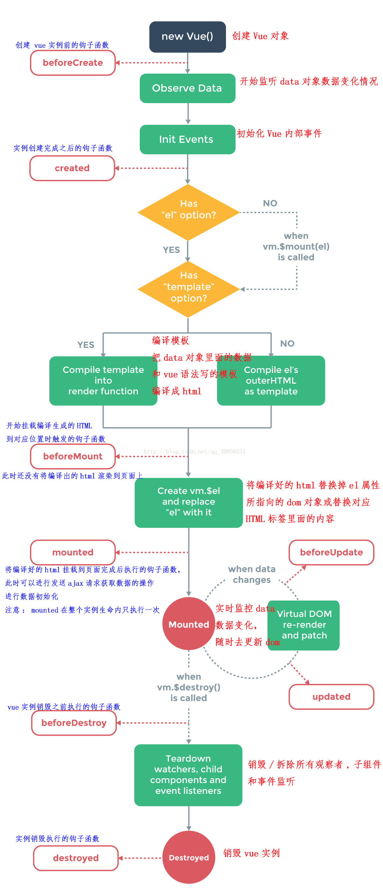

> 风格指南：https://cn.vuejs.org/v2/style-guide/

# 生命周期


# 常用生命周期比对
* beforeCreate
    - ```el```和```data```并未初始化。
* created
    - 完成了```data```数据的初始化，```el```没有。
* beforeMount
    - 完成了```el```初始化。
    - 此时dom尚未被渲染到页面中。
* mounted
    - 完成挂载。
    - 此时dom已被渲染到页面中。

# 其他生命周期钩子
* beforeUpdate
    - 组件更新之前调用
* updated
    - 组件更新之后调用
* beforeDestroy
    - 组件销毁之前调用
* Destroyed
    - 组件销毁之后调用
* activated
    - keep-alive 组件激活时调用
* deactivated
    - keep-alive 组件停用时调用

# 其他
* 父组件内覆盖子组件样式
    - 方案1：父级加个不使用scoped属性的style标签。弊端是会影响到全局的样式。可加页面级独立class进行控制。
    - 方案2：父级继续使用加了scoped属性的style标签。然后使用`/deep/`选择器进行控制即可。如此`.child`就不会带上属性选择器。
    ```
    .parent /deep/ .child {}
    ```

* 如果是通过script标签直接使用vue，建议放到head标签里，这样可以防止出现{{}}导致页面抖动的问题。
    - 如果引入的vuejs文件放在底部，你可以在Vue实例参数的template属性中写模版，也不会出现抖动问题。

* vue-lazyload导致数据图片不更换
    - 先把数据清空，再赋值即可。

* 后续给对象添加属性，不会更新视图，需要使用Vue.set(obj, attr, value)才行。
    - https://cn.vuejs.org/v2/guide/reactivity.html#%E5%A6%82%E4%BD%95%E8%BF%BD%E8%B8%AA%E5%8F%98%E5%8C%96
    - 注意：如果对象和对象的属性不存在，直接绑定到模板template上会报错(js读取null和undefined上的属性会抛错)，可以使用v-if过滤防止报错。

* 生产版本，不能被浏览器上的Vue Devtools工具调试。

# 父子通信
* 父传子 props
* 子传父 this.$emit(fnName, data);
* props是只读的，请遵守这个原则。

# Vue.config.productionTip = false
* 设置为 false 以阻止 vue 在启动时生成生产提示。

# 对象没有属性的时候会报错
* v-if判断，有值的时候才渲染即可。

# v-for
* 需要有key且key不能绑定到template标签上。

# vue-router的fullPath属性
* 如果设置了应用的基路径(即：设置了base属性)。假如基路径为```/base/```。
* 我访问的页面路径是```127.0.0.1:8080/base/goods/detail```。
* 则fullPath的值是```/goods/detail```。

# vue-router导航守卫
* afterEach和beforeEach中this不是Vue的实例。
* 如果需要使用$store。直接使用定义好的变量store即可。
* 如果需要使用$route。回调的参数中就有。

# vue-router重置路由
https://github.com/vuejs/vue-router/issues/1234
```javascript
import Vue from 'vue'
import Router from 'vue-router'

Vue.use(Router)

const createRouter = () => new Router({
  routes: []
})

const router = createRouter()

export function resetRouter () {
  const newRouter = createRouter()
  router.matcher = newRouter.matcher // the relevant part
}

export default router
```

# vue-router设置参数
* 设置参数只能通过meta。
* params接收路由匹配的动态路由数据。例如：路由设置为：```/user/:id```，访问：```/user/10```，可以得到```{id: 10}```。
* query接收路由匹配的query数据。例如：路由设置为：```/user/```，访问：```/user/?id=10```，可以得到```{id: 10}```。

# vue-router踩坑之 - nprogress插件卡顿。进度条超级缓慢增长且一直转圈圈。
* 简洁化之后有问题的代码如下：
```
router.beforeEach((to, from, next) => {
  NProgress.start();
  if (to.path !== '/no-auth/') {
    next({path: '/no-auth/'});
  } else {
    next();
  }
});

router.afterEach(transition => {
  NProgress.done();
});
```
* 重现步骤和原因解析对应：
    1. 输入'/'进入首页，此时会重定向到```/no-auth/```。
    2. 然后点首页路由的按钮。此时会卡死。
* 原因解析和重现步骤对应：
    1. 输入```/```触发```beforeEach```，执行```next({path: '/no-auth/'});```，再次触发```beforeEach```，然后触发```next()```，进入到```/no-auth/```页面，然后触发```afterEach```。
    2. 点首页路由的按钮，触发```beforeEach```，因首页路由的```path```是```/```，则触发```next({path: '/no-auth/'});```。因重定向的路由```/no-auth/```和当前路由```/no-auth/```相同，则不会触发```afterEach```。
* 解决方案：```next({path: 'no-auth'});```的下一行加一句：```NProgress.done();```
* 总结：
    - next重定向的路由如果和当前路由相同，则不会触发```afterEach```。(路由相同则页面不会跳转，微信小程序路由相同也会跳转)。
    - 经测试。如果每次```next```的路由和当前的路由不一致。是会触发```afterEach```的。所以我得出的结论是正确的。

# 报错
* 用webpack3打包vue之后报错：```Cannot read property 'call' of undefined```
    - 报错原因：webpack插件使用错误。```new ExtractTextPlugin(`css/pages/[name].${configEnvironment.contenthash}css`)```。
    - 解决方案：
    ```
    new ExtractTextPlugin({
        filename: `css/pages/[name].${configEnvironment.contenthash}css`,
        allChunks: true,
    })
    ```
* jx-pc项目打包时element-ui报错
    - 报错信息如下：
    ```
    ERROR in static/js/vendor.73b56240afcbef7912d1.js from UglifyJs
    Unexpected token: name (idSeed) [./~/_element-ui@1.4.13@element-ui/src/utils/popup/index.js:7,0][static/js/vendor.73b56240afcbef7912d1.js:18381,4]
    ```
    - 报错原因：因后续使用了cnpm安装依赖包。目录树不一致。
    ```
    {
        test: /\.js$/,
        loader: 'babel-loader',
        include: [
          resolve('node_modules/element-ui/packages'),
          resolve('node_modules/element-ui/src')
        ]
    }
    ```
    - 解决方案：使用正确的包名或者用npm安装依赖。
    ```
    {
        test: /\.js$/,
        loader: 'babel-loader',
        include: [
          resolve('node_modules/_element-ui@1.4.13@element-ui/packages'),
          resolve('node_modules/_element-ui@1.4.13@element-ui/src')
        ]
    }
    ```

# 修饰符.sync
从 2.3.0 起我们重新引入了 .sync 修饰符，但是这次它只是作为一个编译时的语法糖存在。它会被扩展为一个自动更新父组件属性的 v-on 监听器。
* 示例：```<comp :foo.sync="bar"></comp>```
* 会被扩展为：```<comp :foo="bar" @update:foo="val => bar = val"></comp>```
* 当子组件需要更新 foo 的值时，它需要显式地触发一个更新事件：```this.$emit('update:foo', newValue)```
* 完整示例如下：
```
<template>
    <div class="details">
        <myComponent :show.sync='valueChild' style="padding: 30px 20px 30px 5px;border:1px solid #ddd;margin-bottom: 10px;"></myComponent>
        <button @click="changeValue">toggle</button>
    </div>
</template>
<script>
import Vue from 'vue'
Vue.component('myComponent', {
      template: `<div v-if="show">
                    <p>默认初始值是{{show}}，所以是显示的</p>
                    <button @click.stop="closeDiv">关闭</button>
                 </div>`,
      props:['show'],
      methods: {
        closeDiv() {
          this.$emit('update:show', false); //触发 input 事件，并传入新值
        }
      }
})
export default{
    data(){
        return{
            valueChild:true,
        }
    },
    methods:{
        changeValue(){
            this.valueChild = !this.valueChild
        }
    }
}
</script>
```

# vue 自定义组件使用v-model
* v-model只是个语法糖。
    - type="text"和textarea标签对v-model的应用原理类似。如下：
    ```
    <input v-model="value"/>
    等同于
    <input :value="value" @input="value=$event.target.value"/>
    ```
* 自定义组件也能用v-model。只需在子组件内部需要修改value值的地方，触发一下```this.$emit('input', 'newValue')```。就可以实现双向数据绑定了。
    - 一个组件上的 v-model 默认会利用名为 value 的 prop 和名为 input 的事件。
    - 但是像单选框、复选框等类型的输入控件可能会将 value 特性用于不同的目的。
    - model 选项可以用来避免这样的冲突：
    ```
    Vue.component('base-checkbox', {
      model: {
        prop: 'checked',
        event: 'change'
      },
      props: {
        checked: Boolean
      },
      template: `
        <input
          type="checkbox"
          v-bind:checked="checked"
          v-on:change="$emit('change', $event.target.checked)"
        >
      `
    })
    ```
    - 官方v-model文档：https://cn.vuejs.org/v2/guide/components-custom-events.html#%E8%87%AA%E5%AE%9A%E4%B9%89%E7%BB%84%E4%BB%B6%E7%9A%84-v-model
* 我写的简单案例：https://github.com/zhouhuafei/hello-world/tree/master/vue

# radio和checkbox以及select的v-model理解
* 原生的input表单。不同类型。vue的v-model进行了不同的处理。
* v-model源码：https://github.com/vuejs/vue/blob/dev/src/platforms/web/compiler/directives/model.js#L96
* 当我们使用v-model自定义一个radio或者checkbox或者select时，我们需要根据v-model这个语法糖进行我们自己的处理。
    - 不用思考vue的v-model对原生的表单是怎么处理的。
    - 只需要知道v-model这个语法糖用在自定义组件上时表达的意思即可：```一个组件上的 v-model 默认会利用名为 value 的 prop 和名为 input 的事件```。
    - 然后根据v-model所表达的意思去做你想实现的东西。

# vue scope slot
> 作用域插槽
* 步骤一：子组件内部给slot标签上绑定一个属性`<slot name="default" v-bind:todo="todo"></slot>`。
* 步骤二：父组件中使用`slot-scope="slotProps"`接收。然后就可以是`{{slotProps.todo}}`获取到了。
    - `slot-scope="slotProps"`已被废弃，最新语法为`v-slot:default="slotProps"`。
    - `name="default"`和`:default`可省略。
* 文档：https://cn.vuejs.org/v2/guide/components-slots.html#%E4%BD%9C%E7%94%A8%E5%9F%9F%E6%8F%92%E6%A7%BD
* slot 和 scope slot 实践：https://github.com/zhouhuafei/hello-world/blob/master/vue/slot.html
  - 细节1：具名插槽接收时，如果有多个，则只识别最后一个。
  - 细节2：具名或非具名插槽，如果定义了多个，则会渲染多个。
    - 所有没有`v-slot:slotName`属性的结构，都算是一个非具名插槽的内容，会被插入到定义时的非具名插槽里，如果定义了多个非具名插槽，则插入多次。
    - 如果定义了多个具名插槽，则把具名插槽插入到对应的定义点，定义了多个就插入多次。
    - 但是接收时，如果遇到名字相同的具名插槽，则只识别最后一个具名插槽，识别到之后插入到对应到定义点，定义了多次，则插入的多次。和细节1对应。
  - 总结：
    - 定义插槽时：定义多次，则插入多次。
    - 接收插槽时：有名字的只识别最后一个，没名字的都算作一个。

# transition
* https://cn.vuejs.org/v2/guide/transitions.html

# 在动态组件上使用 keep-alive
* keep-alive 是Vue的内置组件，能在组件切换过程中将状态保留在内存中，防止重复渲染DOM。
* 注意：注意这个 <keep-alive> 要求被切换到的组件都有自己的名字，不论是通过组件的 name 选项还是局部/全局注册。
* 组件激活时调用钩子：activated
* 组件停用时调用钩子：deactivated
* 文档：https://cn.vuejs.org/v2/guide/components-dynamic-async.html#%E5%9C%A8%E5%8A%A8%E6%80%81%E7%BB%84%E4%BB%B6%E4%B8%8A%E4%BD%BF%E7%94%A8-keep-alive
* 文档：https://cn.vuejs.org/v2/api/#keep-alive
* keep-alive组件属性：
    - include - 字符串或正则表达式。只有名称匹配的组件会被缓存。
    - exclude - 字符串或正则表达式。任何名称匹配的组件都不会被缓存。
    - max - 数字。最多可以缓存多少组件实例。

# 使用keep-alive缓存路由页面
* 缓存路由的原理
```
<template>
    <keep-alive :include="keepAliveInclude">
        <router-view />
    </keep-alive>
</template>
<script>
export default {
  computed: {
    keepAliveInclude () {
      return this.$store.getters.keepAliveInclude // ['homePage', 'myPage']
    }
  }
}
</script>
```
* 增加缓存：方式1
```
router.afterEach((to, from) => {
  setTimeout(() => {
    // 不加定时器的话，此处的执行会快于$fnDelKeepAliveInclude对应的点击事件。
    // 如此，点击router-link时，此处先执行，先增加了缓存，但是点击后执行，又清理了缓存。
    // 故，需要定时器异步一下。让同步的click执行完，再执行定时器的异步回调。
    if (to.meta.keepAlive) store.dispatch('AddKeepAliveInclude', to.name)
  }, 0)
  NProgress.done()
})
```
* 增加缓存：方式2
```
router.afterEach(async (to, from) => {
  // afterEach 钩子执行之后会触发 DOM 更新（需在下次 DOM 更新循环结束之后延迟执行）
  await Vue.nextTick()
  if (to.meta.keepAlive) store.dispatch('AddKeepAliveInclude', to.name)

  NProgress.done()
})
```
* 想移除缓存就
```
<router-link
  :to="to"
  @click.native="$fnDelKeepAliveInclude"><slot/>
</router-link>
```
* 其他代码
```
Vue.prototype.$fnDelKeepAliveInclude = () => {
  store.dispatch('DelKeepAliveInclude')
}
```
* 领悟`Vue.nextTick`和`this.$nextTick`和关系。
    - this.$nextTick是对Vue.nextTick的二次封装。
    - `this.$nextTick === Vue.nextTick // false`。
* 领悟`Vue.set`和`this.$set`和关系。
    - this.$set是对Vue.set的引用。
    - `this.$set === Vue.set // true`。

# 监听路由变化
> 页面跳转前后，如果两个页面使用的是同一个组件(例如动态路由跳转和query跳转)，则组件会被复用，这也意味着组件的生命周期钩子不会再被调用。
* 提醒一下，当使用`动态路由`时，例如从`/user/foo`导航到`/user/bar`，原来的组件实例会被复用。
* 因为两个路由都渲染同个组件，比起销毁再创建，复用则显得更加高效。
* 不过，这也意味着组件的生命周期钩子不会再被调用。
* 复用组件时，想对路由参数的变化作出响应的话，你可以简单地`watch`(监测变化)`$route`对象。
```
const User = {
  template: '...',
  watch: {
    '$route' (to, from) {
      // 对路由变化作出响应...
    }
  }
}
```
或使用组件内守卫```beforeRouteUpdate```
```
const Foo = {
  template: `...`,
  beforeRouteEnter (to, from, next) {
    // 在渲染该组件的对应路由被 confirm 前调用
    // 不！能！获取组件实例 `this`
    // 因为当守卫执行前，组件实例还没被创建
  },
  beforeRouteUpdate (to, from, next) {
    // 在当前路由改变，但是该组件被复用时调用
    // 举例来说，对于一个带有动态参数的路径 /foo/:id，在 /foo/1 和 /foo/2 之间跳转的时候，
    // 由于会渲染同样的 Foo 组件，因此组件实例会被复用。而这个钩子就会在这个情况下被调用。
    // 可以访问组件实例 `this`
  },
  beforeRouteLeave (to, from, next) {
    // 导航离开该组件的对应路由时调用
    // 可以访问组件实例 `this`
  }
}
```

# nextTick
在下次 DOM 更新循环结束之后执行延迟回调。在修改数据之后立即使用这个方法，获取更新后的 DOM。
```
new Vue({
  // ...
  methods: {
    // ...
    example: function () {
      // 修改数据
      this.message = 'changed'
      // DOM 还没有更新
      this.$nextTick(function () {
        // DOM 现在更新了
        this.doSomethingElse() // this指向Vue的实例，此处使用箭头函数或者function关键字都可以正确获取到this。
      })
    }
  }
})
```

# 使用手机端ui框架时，怎么做rem适配？
* 使用```postcss-px2rem```插件。
    - https://github.com/songsiqi/px2rem-postcss
* 或者```px2rem-loader```。
    - https://github.com/Jinjiang/px2rem-loader
* 总结：
    - 我看网上教程的案例里，设置的都是75。应该是按照750设计图搞的。
    - 这样的话ui库的样式会变小吧。因为ui库一般是按照320或者375设计的。
    - 理应设置为32或者37.5。然后做网页的时候设计师也应该给320或者375的设计图。如果是静态图片再单独给高倍图。
    - 尚未亲自实践。以上言论纯属理论。

# Vue实现双向数据绑定时使用的基础方法
> 细节就不进行深入了解了。
* vue2：```Object.defineProperty方法```
* 文档 https://developer.mozilla.org/zh-CN/docs/Web/JavaScript/Reference/Global_Objects/Object/defineProperty
```
var obj = {};
Object.defineProperty(obj, 'txt', {
    get: function () {
        console.log('获取');
        return obj;
    },
    set: function (newValue) {
        console.log('设置');
        return newValue;
    },
});
obj.txt = '123'; // 此时会打印：'设置'。
obj.txt; // 此时会打印：'获取'。然后打印出：{}。
```
* vue3：```Proxy```
* 文档：https://developer.mozilla.org/zh-CN/docs/Web/JavaScript/Reference/Global_Objects/Proxy
```
var obj = {};
var handler = {
    get(target, property) {
        console.log(`${property} 被读取`);
        return property in target ? target[property] : 3;
    },
    set(target, property, newValue) {
        console.log(`${property} 被设置为 ${newValue}`);
        target[property] = newValue;
    },
};
var p = new Proxy(obj, handler);
p.name = 'tom'; // 此时会打印：'name 被设置为 tom'。
p.age; // 此时会打印：'age 被读取'。然后打印出：3。
```

# MVVM
* Model 数据层
* View 视图层
* ViewModel：把Model和View关联起来的就是ViewModel。ViewModel负责把Model的数据同步到View显示出来，还负责把View的修改同步回Model。

# MVC
* Model 数据层
* View 视图层
* Controller 控制层

# v-for为什么要加key
* https://cn.vuejs.org/v2/guide/list.html#key
* https://www.jianshu.com/p/4bd5e745ce95
* 防止Vue对DOM的就地复用，让DOM具有唯一性。否则会出现一些不必要的bug。
    - 案例：使用v-if处理A和B两个input框时(默认为空值)，当其中一个输入框A里输入了值之后，再让另外一个输入框B显示时，会发现输入框B中也有了和A输入框一模一样的值。因Vue的就地复用策略导致的这个原因。
    - 解决方案：给两个输入框加不同的key值。
    - https://blog.csdn.net/qq_17832583/article/details/80567697
* key不建议为循环的索引(因为索引可能会变化，如此，虚拟dom的diff算法便会不精准)。一般为每一项的唯一id。
    - 问：如果没有唯一id怎么办？例如草动店铺装修，编辑两个相同且相邻的组件时，编辑区的上移和下移无效。
    - 答：上移和下移时，把数据进行清空，然后重新赋值即可。
    ```
    const list = this.form.list
    this.form.list = []
    this.$nextTick(() => {
      this.form.list = list
    })
    ```

#  $emit与$on
```
vue中$emit与$on
const Event = new Vue(); // 相当于又new了一个vue实例，Event中含有vue的全部方法。
Event.$emit('msg', {msg: 'msg'}); // 发送数据，第一个参数是发送数据的名称，接收时还用这个名字接收，第二个参数是这个数据现在的位置。
Event.$on('msg', function (json) { // 接收数据，第一个参数是数据的名字，与发送时的名字对应，第二个参数是一个方法，要对数据的操作。
  // 这里是对数据的操作
});
```
* 上述操作可用来进行非父子组件之间的通信(如果不使用vuex)。在created或者mounted钩子中使用$on监听即可。在需要通信的地方使用$emit进行通信即可。

# vue模版可以把布尔值true和false渲染出来
* react的jsx语法不会把布尔值true和false渲染出来。
    - null和undefined也不会被渲染出来(vue和react都不会被渲染出来)。

# 普通数组如果使用以下两种方式进行修改是无法驱动视图的
* 以下两种方式是无法驱动视图的。
    - 1、```arr[0] = 'abc'```
    - 2、```arr.length = 1```
* 所以要使用以下两种替代方案
    - https://cn.vuejs.org/v2/guide/list.html#%E6%B3%A8%E6%84%8F%E4%BA%8B%E9%A1%B9
    - ```Vue.set(vm.items, indexOfItem, newValue)```
    - ```vm.items.splice(indexOfItem, 1, newValue)```
* 但是我发现如果数组中的每一项是对象。
    - 可以通过索引```arr[0].name = 'name'```驱动视图。
    - 此时。紧跟着再使用```arr[0] = {name: 'name1'}```或者```arr.length = 1```也是可以驱动视图的。
    - 总结：即使是普通数组也是可行的。只要你先驱动一次视图，紧跟着再使用索引和length都是可以驱动视图的。

# 组件回显
> 先通过props传入一个默认值(defaultValue)
* 方式1：
    - 在组件内部在created钩子中，处理默认值，让组件内部的data数据进行回显。
    - 使用组件时，需要在组件上使用v-if，否则不会多次触发created钩子。
    - 疑问：为何不封装组件的时候，直接在组件内部使用v-if？
        - 答：亲测，组件内部使用v-if，显示和隐藏无法触发created。需要在使用组件的地方，组件标签的本身上使用v-if，显示隐藏时才可以触发created钩子。
* 方式2：
    - 在组件内部使用watch监听默认值，让组件内部的data数据进行回显。
    - 问题：watch可能会触发多次。
        - 1、默认值在接口响应之后初次被修改会触发一次。
        - 2、当子组件触发```自定义change```事件，父组件监听此事件并在此事件中修改了默认值时(手动修改或使用了computed)又会触发一次。

# 监听props的改变
> props无法修改，下述所说修改的意思是指重新赋值给一个别的变量。
* 1、如果不需要修改props，则可以直接使用props。
* 2、如果需要修改，可使用data，配合watch。
    - 每次修改都会触发watch中的监听方法。
    ```
    watch: {
        msg (newValue) {
            console.log('msg改变，这里会打印')
        }
    }
    ```
* 3、如果需要修改，可使用computed。
    - 方法中对应属性修改会触发computed中的方法。(有缓存，数据变化时才会重新求值)
    ```
    computed: {
        myMsg () {
            console.log('msg改变，这里会打印')
            return this.msg
        }
    }
    ```
* 4、如果需要修改，可使用methods。
    - 方法中对应属性修改会触发methods中的方法。(无缓存，每次都会重新求值)
    ```
    methods: {
        myMsg () {
            console.log('msg改变，这里会打印')
            return this.msg
        }
    }
    ```
* computed VS methods对比 https://cn.vuejs.org/v2/guide/computed.html#%E8%AE%A1%E7%AE%97%E5%B1%9E%E6%80%A7%E7%BC%93%E5%AD%98-vs-%E6%96%B9%E6%B3%95
* computed传参。
```
<div id="app">
  <p>{{newItem('world')}}</p>
</div>
<script>
new Vue({
  el: '#app',
  data () {
    return {
      value: 'hello'
    }
  },
  computed: {
    newItem () {
      return (val) => {
        return this.value + ' - ' + val
      }
    }
  },
  created () {
    setTimeout(() => {
      this.value = 'new - hello'
    }, 2000)
  }
})
</script>
```

# 禁用特性继承
* element的input框是怎么封装的？怎么获取一些未赋值到props上的原生属性给input。
    - inheritAttrs: false
    - $attrs
    - ```v-bind="$attrs"```
    - https://cn.vuejs.org/v2/guide/components-props.html#%E7%A6%81%E7%94%A8%E7%89%B9%E6%80%A7%E7%BB%A7%E6%89%BF
    - https://github.com/ElemeFE/element/blob/dev/packages/input/src/input.vue
* 将原生事件绑定到组件
    - .native修饰符有局限性
    - Vue 提供了一个 $listeners 属性，它是一个对象，里面包含了作用在这个组件上的所有监听器。
    - https://cn.vuejs.org/v2/guide/components-custom-events.html#%E5%B0%86%E5%8E%9F%E7%94%9F%E4%BA%8B%E4%BB%B6%E7%BB%91%E5%AE%9A%E5%88%B0%E7%BB%84%E4%BB%B6

# $refs
* 一个对象，持有注册过 ref 特性 的```所有 DOM 元素```和```组件实例```。
    - 如果 ref 注册到html标签上，那获取到的就是 DOM 元素。
    - 如果 ref 注册到组件上，那获取到的就是组件实例。

# element-ui踩坑
> element-ui没有清零样式。这点很赞，没有全局的清零样式，就不会覆盖markdown的默认样式。
* el-popover在表单中使用的时候，最后一行按钮对应的弹窗会显示不出来。
    - 解决方案：按钮放在el-popover中并加上slot="reference"属性以及去掉v-popover:popover指令即可。
* 初始位置如果是数字则初始位置之后不被允许输入小数点(element-ui做的处理)
```html
<el-form-item
prop="validHour"
label="成团时效"
class="w500">
<el-input
  :disabled="see"
  v-model.number="form.validHour">
  <template slot="append">小时</template>
</el-input>
</el-form-item>
```
* `slot="append"`的是否显示，`element-ui`是通过`v-if="$slots.append"`控制的。
* 做草动商城时，需要做选择拼团的弹窗。需要支持单选和多选。点击一行也需要选中。需要支持回显。单选用的el-radio。多选用的el-table自带的多选。以下是踩坑时刻。
    - table的rowClick会导致el-radio的change事件触发不了。如果想监听el-radio的变化，则只能使用watch。
    - 弹窗应用table多选或者单选，回显时带id进去即可，选择完也只传回id即可。如果需要具体参数，则根据id打接口拿具体数据。多选编辑时注意数据回传处理，别丢数据。单选没有这个问题。
        - 问：多选编辑时怎么处理数据回传？
        - 答：只需要从接口给的那一页数据中，找到哪些数据没被选中，然后从已选集合中移除。那么剩下的，就全都是被选中的。
        - 注：单选多选一定要先加条件判断```this.isMultiple```再执行对应逻辑，避免多余的影响。
* el-table错位
    - 解决方案：给```el-table-column```组件加```:show-overflow-tooltip="true"```。
    - 如果还是错位？
    - 解决方案：看下内容中是否有img标签。如果有，则把img标签转成块元素。或者加```vertical-align: middle;```。```bottom || top```也行。
* 表单验证时，提示错位。
    - 问题原因：我使用css修改了el-form-item组件中label的width。
    - 解决方案：在el-form组件上使用label-width控制label的width。
* el-dialog组件，后弹出的，被前面弹出的覆盖掉了。
    - 解决方案：给el-dialog加```append-to-body```属性。
* el-form，rules校验，怎么把不需要带给后端的数据，不放到form对象里，并能使校验生效？
    - 答：无解。如果想要校验，就需要把数据放到form对象里，配合上prop属性。如此才能被el-form的校验规则识别。
    - 如果不想把无关数据提交给后端，则无关数据用下划线开头，并在提交数据前进行过滤即可。
    - 注：不要直接删除form上下划线开头的数据。会导致渲染异常。使用拷贝的方式，把需要提交给后端的数据拷贝一份提交给后端即可。
    ```
    <template>
      <el-form
        ref="form"
        :model="form"
        :rules="rules"
        label-width="100px">
        <el-form-item
          label="活动名称1"
          prop="name1">
          <el-input v-model="form.name1" />
        </el-form-item>
        <el-form-item
          :rules="rules._name2"
          label="活动名称2"
          prop="_name2">
          <el-input v-model="form._name2" />
        </el-form-item>
        <el-form-item>
          <el-button
            type="primary"
            @click="submitForm('form')">立即创建
          </el-button>
          <el-button @click="resetForm('form')">重置</el-button>
        </el-form-item>
      </el-form>
    </template>
    <script>
    export default {
      data () {
        return {
          form: {
            name1: '',
            _name2: '_name2不在form中(不传给后端)，但是也要能被校验。怎么做？'
          },
          rules: {
            name1: [{ required: true, message: '请输入活动名称1', trigger: 'blur' }],
            _name2: [{ required: true, message: '请输入活动名称2', trigger: 'blur' }]
          }
        }
      },
      methods: {
        submitForm (formName) {
          this.$refs[formName].validate((valid) => {
            if (valid) {
              const submitData = {}
              Object.keys(this.form).forEach(key => {
                if (key[0] !== '_') {
                  submitData[key] = this.form[key]
                }
              })
              console.log('过滤后的submitData数据', submitData)
            } else {
              console.log('error submit!!')
              return false
            }
          })
        },
        resetForm (formName) {
          this.$refs[formName].resetFields()
        }
      }
    }
    </script>
    ```
    - el-form校验：el-form组件上绑定了model和rules属性且el-form-item组件上绑定了prop属性才会校验，注：el-form-item组件不存在(不被渲染)时则对应规则不会被校验。
* `el-tabs`导致`el-table`闪烁。
    - 原因：我给`el-table-column`加了`:key="String(Math.random()).substring(2)"`。
    - 经过测试，发现只要给`el-table-column`加key，就会闪烁。
    - 解决方案：不给`el-table-column`加key。
    - 不加的话，又可能会导致下面的问题。还请自行思量。
* el-table-column渲染的字段错位。
    - 问题原因：使用v-if区别渲染了分销商和导购的字段。因vue的就地复用策略导致如此问题。
    - 解决方案：```:key="String(Math.random()).substring(2)"```。
* el-dialog封装成组件A时，要使用`:before-close`修改组件A的props上控制组件A是否显示的那个属性，否则会抛错。
    - 因为组件A的props不可被更改，el-dialog的`@close`被触发，就会修改组件A的props上控制组件A是否显示的那个属性。
* el-date-picker只允许选取上下浮动31天的日期。
```
<template>
  <div>
    <el-date-picker
      :picker-options="pickerOptions"
      v-model="date2"
      :default-time="['00:00:00', '23:59:59']"
      format="yyyy-MM-dd HH:mm:ss"
      value-format="yyyy-MM-dd HH:mm:ss"
      type="datetimerange"
      size="small"
      range-separator="至"
      start-placeholder="开始日期"
      end-placeholder="结束日期"
      @change="dateChange2" />
  </div>
</template>
<script>
import { dateFormat } from '@/utils/index'

export default {
  data () {
    return {
      date2: [dateFormat(new Date().setDate(new Date().getDate() - 7), '{y}-{m}-{d}' + ' 00:00:00'), dateFormat(new Date(), '{y}-{m}-{d}' + ' 23:59:59')],
      pickerMinDate: '',
      pickerOptions: {
        onPick: ({ maxDate, minDate }) => {
          this.pickerMinDate = minDate.getTime()
          if (maxDate) {
            this.pickerMinDate = ''
          }
        },
        disabledDate: (time) => {
          if (this.pickerMinDate !== '') {
            let one = (31 - 1) * 24 * 3600 * 1000 // 31天比较合适 因为一个月最多31天
            let minTime = this.pickerMinDate - one
            let maxTime = this.pickerMinDate + one
            // 不能选取大于当前日期的日期
            // if (maxTime > new Date()) {
            //   maxTime = new Date()
            // }
            return time.getTime() < minTime || time.getTime() > maxTime
          }
          return false
          // 不能选取大于当前日期的日期
          // return time.getTime() > Date.now()
        },
        shortcuts: [1, 3, 5, 7, 10, 15, 28, 29, 30, 31].map((item) => {
          return {
            text: `最近${item}天`,
            onClick (picker) {
              const end = new Date()
              end.setHours(23)
              end.setSeconds(59)
              end.setMinutes(59)
              const start = new Date()
              start.setTime(start.getTime() - 3600 * 1000 * 24 * (item - 1))
              start.setHours(0)
              start.setSeconds(0)
              start.setMinutes(0)
              picker.$emit('pick', [start, end])
            }
          }
        })
      }
    }
  },
  methods: {
    dateChange2 (val) {
      console.log('dateChange2', val)
    }
  }
}
</script>
```
* el-tabs卡片化 - 卡片化的标签页。
```
<el-tabs type="border-card">
  <el-tab-pane label="用户管理">用户管理</el-tab-pane>
  <el-tab-pane label="配置管理">配置管理</el-tab-pane>
  <el-tab-pane label="角色管理">角色管理</el-tab-pane>
  <el-tab-pane label="定时任务补偿">定时任务补偿</el-tab-pane>
  我个人比较喜欢这个样式。
</el-tabs>
```

# $set
> https://cn.vuejs.org/v2/guide/reactivity.html#%E6%A3%80%E6%B5%8B%E5%8F%98%E5%8C%96%E7%9A%84%E6%B3%A8%E6%84%8F%E4%BA%8B%E9%A1%B9
* 受现代 JavaScript 的限制 (而且 Object.observe 也已经被废弃)，Vue 无法检测到对象属性的添加或删除。由于 Vue 会在初始化实例时对属性执行 getter/setter 转化，所以属性必须在 data 对象上存在才能让 Vue 将它转换为响应式的。
* 对于已经创建的实例，Vue 不允许动态添加根级别的响应式属性。但是，可以使用 ```Vue.set(object, propertyName, value)``` 方法向嵌套对象添加响应式属性。

# SSR和预渲染
* 官方文档：https://ssr.vuejs.org/zh/#什么是服务器端渲染-ssr-？

# vue-cli能读取项目根目录以外的文件么？
* 能。

# node-sass安装不上
* 解决方案：`npm i node-sass --sass_binary_site=https://npm.taobao.org/mirrors/node-sass/`

# 刷新页面时，create钩子中获取不到vuex里的userInfo
* 解决方案：在```router.beforeEach```中进行控制，当接口返回之后，再触发```next()```。

# vue长列表优化了解一下
* 插件：https://github.com/tangbc/vue-virtual-scroll-list
    - 别人对这个插件的总结：https://www.cnblogs.com/imwtr/p/10428819.html
    - 这个插件，是一次性拿到1万条数据进行列表滚动展示的那种(耗内存)。不符合分页展示的需求。
* 为何要对数据量大的列表页进行滚动加载优化呢？
    - 主要的一个原因就是页面上元素太多了，滚动的时候会有卡顿的问题，移动端上更为明显。
    - 那既然元素太多导致的问题，解决方法不就很明显了吗？没错，就是 **减少页面元素**。
    - 别人的方案：https://github.com/hejianxian/vue-list
    - 别人的DEMO：https://hejx.herokuapp.com/vue-list/
    - 别人方案的表象：
        - 1. 基于容器wrap进行滚动。内部item的数量是固定的，内部item的高度是固定的。
        - 2. list的padding-top默认为0，越往下滚动，值越大，越往上滚，值越小。
        - 3. list的padding-bottom默认很大，越往下滚动，值越小，当值为0出现loading，loading完毕，padding-bottom又变为大值。
* 个人总结：分页展示，一页10个，要拉到底部1000次才1万条数据。我觉的不优化也可以哈。

# $event
* 在原生事件中，$event是事件对象。
* 在自定义组件的自定义事件中，$event是传递过来的数据。

# Vue.extend
> 使用基础 Vue 构造器，创建一个“子类”。参数是一个包含组件选项的对象。
* 注意：extend创建的是一个组件构造器(构造函数)，而不是一个具体的组件实例。
* 案例：
```
// 创建构造器
var Profile = Vue.extend({
  template: '<p>{{firstName}} {{lastName}} aka {{alias}}</p>',
  data: function () {
    return {
      firstName: 'Walter',
      lastName: 'White',
      alias: 'Heisenberg'
    }
  }
})
```
* 用法1：创建 Profile 实例，并挂载到一个元素上。
```
new Profile().$mount('#mount-point')
```
* 用法2：注册全局组件
```
Vue.component('Profile', Profile)
```
* 用法3：注册局部组件
```
{
  components: {
    Profile: Profile
  }
}
```
// 用法4：vue单文件改造为ts，使用Vue.extend，改动最小。
```
<script lang="ts">
export default Vue.extend({
  data () {
    return {}
  }
})
</script>
```

# 如何手动调用`Vue`的钩子函数？
> 调用时需注意this指向。可使用call或者apply进行this指向修正。
* 在`Vue`实例中，钩子方法是直接绑定在`$options`上的，直接使用`this.$options`调用即可。
* 在`VueComponent`实例中，钩子方法是绑定在`$options`的`__proto__`上的，使用`this.$options`调用即可。
> 但是没必要这么做，因为定义一个myInit方法使用起来更安全不是么。

# Vue 改变单页面的背景色
```
export default {
  name: 'your name',
  beforeCreate () {
    document.querySelector('body').setAttribute('style', 'background:#fff')
  },
  beforeDestroy () {
    document.querySelector('body').setAttribute('style', '')
  }
}
```

# `~` 和 `@`
> https://webpack.docschina.org/loaders/sass-loader/#%E5%AF%BC%E5%85%A5-import-
* webpack 提供一种解析文件的高级的机制。
  - sass-loader 使用 Sass 的 custom importer 特性，将所有的 query 传递给 webpack 的解析引擎(resolving engine)。
  - 只要它们前面加上 ~，告诉 webpack 它不是一个相对路径，这样就可以 import 导入 node_modules 目录里面的 sass 模块。
  - `~`线表示`bootstrap`不是一个相对路径：
  ```
  @import "~bootstrap/dist/css/bootstrap";
  ```
  - `~`线表示`element-ui`不是一个相对路径：
  ```
  @import "~element-ui/packages/theme-chalk/src/index";
  ```
* 常常会在vue项目中看到这样的情形：
  ```
  @import "../../../../assets/css/varibles.scss";
  ```
  - 可以简写为以下：
  ```
  @import "~@/assets/css/varibles.scss";
  ```
  - `@`是别名，一般表示根目录下的`src`目录。
  - `@`是别名，在`scss`中使用时，必须要带`~`线前缀(`~`线表示`@`不是一个相对路径)，否则打包时会报错。
  - `@`是别名，在`js`中使用时，不允许带`~`线前缀，否则打包时也会报错，因为`~`是`sass-loader`的特性。
